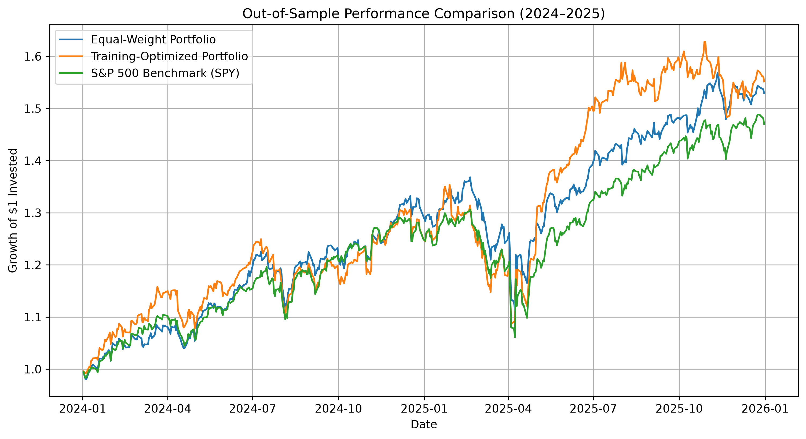

# Portfolio Optimisation and Risk Analysis

## Overview

This project uses Python and financial mathematics to analyse historical stock performance, measure investment risk, and optimise portfolio allocations. It explores the relationship between risk and return using historical market data, and then tests honestly whether optimised portfolios hold up on data they were not built from.

**Headline finding:** a maximum-Sharpe portfolio looks good in-sample but is unstable out-of-sample. Across three rolling test windows, a simple equal-weight portfolio (average Sharpe ratio 1.53) beat the unconstrained optimiser (0.51) and the S&P 500 (1.27). Constraining the weights and removing expected returns from the optimisation closed most of the gap, but did not beat equal-weight.

## Objectives

* Analyse historical stock returns and volatility.
* Examine relationships between assets using covariance and correlation.
* Construct and compare portfolios with different investment strategies.
* Minimise portfolio volatility through numerical optimisation.
* Identify the maximum-return and maximum-Sharpe-ratio portfolios.
* Visualise portfolio risk and return using the efficient frontier.
* Test whether optimised portfolios perform well on unseen data, and which fixes (weight caps, covariance shrinkage, minimum-variance) improve their stability.

## Assets Analysed

* Apple (AAPL)
* Microsoft (MSFT)
* Amazon (AMZN)
* JPMorgan Chase (JPM)
* Coca-Cola (KO)

Daily adjusted prices from January 2021 to December 2025. The S&P 500 ETF (SPY) is used as the benchmark and the risk-free rate is assumed to be 4%.

## Technologies

* Python
* pandas and NumPy
* Matplotlib
* SciPy
* scikit-learn
* yfinance
* Jupyter Notebook

## Methods

1. Download and prepare historical market data.
2. Calculate daily returns and annualised performance metrics.
3. Estimate covariance and correlation between assets.
4. Construct an equally weighted portfolio.
5. Optimise portfolio allocations under long-only constraints.
6. Compare minimum-risk, maximum-return, and maximum-Sharpe-ratio portfolios.
7. Simulate random portfolios and calculate the efficient frontier.
8. Compare against the S&P 500 benchmark.
9. Validate out-of-sample with a single train/test split.
10. Validate with three rolling windows (train on two years, test on the next year).
11. Test improvements: weight caps, Ledoit-Wolf covariance shrinkage, and minimum-variance portfolios.

## Key Results (Full Period, In-Sample)

These results use the whole 2021-2025 sample for both estimation and evaluation, so they describe history rather than predict performance.

| Portfolio | Annual Return | Annual Volatility | Sharpe Ratio |
| --------- | ------------: | ----------------: | -----------: |
| Equal Weight | 17.50% | 18.81% | 0.72 |
| Minimum Risk | 14.05% | 13.96% | 0.72 |
| Maximum Return (100% JPM) | 24.45% | 24.27% | 0.84 |
| Maximum Sharpe | 20.84% | 17.98% | 0.94 |

Over the same period the S&P 500 benchmark (SPY) returned 15.20% with volatility of 17.11%.

The minimum-risk portfolio is concentrated in Coca-Cola (66.32%), and the maximum-Sharpe portfolio in JPMorgan Chase (54.06%) and Microsoft (26.59%). These results illustrate the trade-off between return and risk, and how optimisation tends to concentrate in a few assets.

## Visualisations

### Efficient Frontier


### Cumulative Stock Returns


## Out-of-Sample Validation (Single Split)

To evaluate the optimised strategy on data not used during optimisation, the data was divided into a training period (2021-2023) and a testing period (2024-2025). The maximum-Sharpe weights were estimated on the training period and evaluated on the testing period.

| Portfolio                    | Annual Return | Annual Volatility | Sharpe Ratio |
| ---------------------------- | ------------: | ----------------: | -----------: |
| Equal-Weight Portfolio       |        22.67% |            16.42% |         1.14 |
| Training-Optimised Portfolio |        23.84% |            18.93% |         1.05 |
| S&P 500 Benchmark (SPY)      |        20.68% |            16.37% |         1.02 |

The training-optimised portfolio had the highest annualised return, but also the highest volatility. Adjusted for risk, it ranked behind the equal-weight portfolio (Sharpe 1.05 vs 1.14) and only slightly ahead of SPY (1.02).

The optimised allocation was concentrated in Microsoft (62.54%) and JPMorgan Chase (37.46%). This shows how mean-variance optimisation can produce concentrated allocations when it relies on estimated returns and covariance.

### Out-of-Sample Performance

The chart below compares the cumulative growth of the equal-weight portfolio, training-optimised portfolio, and S&P 500 benchmark during the 2024-2025 testing period.



## Rolling-Window Validation

A single split can be lucky or unlucky, so the test was repeated on three rolling windows, each training on two years and testing on the following year.

| Train     | Test |
| --------- | ---- |
| 2021-2022 | 2023 |
| 2022-2023 | 2024 |
| 2023-2024 | 2025 |

Sharpe ratios by test year:

| Portfolio | 2023 | 2024 | 2025 | Average |
| --------- | ---: | ---: | ---: | ------: |
| Equal-Weight | 2.15 | 1.67 | 0.78 | **1.53** |
| SPY | 1.55 | 1.51 | 0.73 | 1.27 |
| Optimised (no cap) | -0.57 | 1.41 | 0.68 | 0.51 |

**Findings**

* The unconstrained optimiser lost to equal-weight in all three years and averaged a Sharpe ratio of 0.51, versus 1.53 for equal-weight and 1.27 for SPY.
* The worst case was 2023. Training on 2021-2022 put 100% in Coca-Cola, which then returned -3.67%.
* The weights changed completely between windows (KO only, then MSFT and JPM, then AAPL, AMZN and JPM). This instability is why the single-split result should not be trusted on its own.

## Improving the Optimiser

Three fixes were tested on the same rolling windows.

### 1. Weight Caps

Each stock's weight was limited to 40% or 30%.

### 2. Ledoit-Wolf Covariance Shrinkage

The sample covariance matrix was replaced with a Ledoit-Wolf shrinkage estimate, to test whether noisy covariance estimates caused the instability.

### 3. Minimum-Variance Portfolio

Expected returns were removed from the optimisation entirely, so only the covariance matrix is used.

### Results

| Portfolio | 2023 | 2024 | 2025 | Average Sharpe |
| --------- | ---: | ---: | ---: | -------------: |
| Equal-Weight | 2.15 | 1.67 | 0.78 | **1.53** |
| Min-Variance (30% cap) | 1.74 | 1.66 | 1.04 | 1.48 |
| Max-Sharpe, LW shrinkage (30% cap) | 1.74 | 1.59 | 0.64 | 1.32 |
| Max-Sharpe (30% cap) | 1.74 | 1.59 | 0.65 | 1.32 |
| SPY | 1.55 | 1.51 | 0.73 | 1.27 |
| Max-Sharpe (40% cap) | 1.38 | 1.53 | 0.68 | 1.20 |
| Min-Variance (no cap) | 0.20 | 0.98 | 1.06 | 0.75 |
| Max-Sharpe, LW shrinkage (no cap) | -0.55 | 1.41 | 0.68 | 0.51 |
| Max-Sharpe (no cap) | -0.57 | 1.41 | 0.68 | 0.51 |

**Findings**

* **Weight caps helped most.** A 30% cap raised the average Sharpe ratio from 0.51 to 1.32 and removed the 100% Coca-Cola outcome. With five assets, a 20% cap is exactly equal-weight, so tighter caps push the portfolio towards equal-weight.
* **Shrinkage made almost no difference.** Ledoit-Wolf shrinkage intensity was only 2.0-3.6%, and the weights and Sharpe ratios were essentially unchanged. With five assets and about 500 daily observations per window, the covariance matrix is already well estimated.
* **Expected-return estimates are the main weakness.** Removing them (minimum-variance) raised the uncapped average Sharpe ratio from 0.51 to 0.75. However, the uncapped version still held 60-76% in Coca-Cola and lagged the 2023-2025 rally.
* **The best optimised portfolio was minimum-variance with a 30% cap** (1.48). It beat SPY in all three years, but still finished just behind equal-weight (1.53).

**Conclusion:** across every method tested, a simple equal-weight portfolio was hard to beat. Diversification and constraints mattered more than optimisation sophistication.

## Project Structure

```text
portfolio-optimisation/
├── data/
├── notebooks/
│   └── 01_data_exploration.ipynb
├── results/
│   ├── portfolio_comparison.csv
│   ├── optimal_weights.csv
│   ├── out_of_sample_comparison.csv
│   ├── out_of_sample_weights.csv
│   ├── rolling_window_comparison.csv
│   ├── rolling_window_capped.csv
│   ├── rolling_window_all.csv
│   ├── efficient_frontier.png
│   ├── individual_stock_risk_return.png
│   ├── cumulative_returns.png
│   └── out_of_sample_growth.png
├── src/
├── requirements.txt
├── README.md
└── .gitignore
```

## Limitations

* The analysis uses historical data, which does not guarantee future performance.
* Only five large US stocks were used, and they were chosen with hindsight, which flatters every portfolio, including equal-weight.
* Each test year has only about 252 trading days and there are only three test windows, so results are noisy.
* The cap levels (40% and 30%) were chosen after seeing earlier results and evaluated on the same windows, so the improvements are slightly flattering.
* With five assets, a 30% cap leaves little room to deviate from equal-weight, so much of the improvement comes from the cap rather than the optimiser.
* The optimisation assumes estimated returns and covariance are useful inputs for portfolio construction. The results suggest estimated returns are not reliable over two-year windows.
* Transaction costs, taxes, rebalancing costs, and changing market conditions are not modelled.

## Skills Demonstrated

Python programming, data analysis, statistical risk measurement, linear algebra, numerical optimisation, financial mathematics, data visualisation, out-of-sample and rolling-window validation, and honest interpretation of quantitative results.

## How to Run the Project

### 1. Clone the repository

```bash
git clone https://github.com/nsovohope62/portfolio-optimisation.git
cd portfolio-optimisation
```

### 2. Create a virtual environment

```bash
python -m venv .venv
```

Activate it:

**Linux / GitHub Codespaces / macOS**

```bash
source .venv/bin/activate
```

**Windows**

```bash
.venv\Scripts\activate
```

### 3. Install dependencies

```bash
pip install -r requirements.txt
```

### 4. Run the notebook

```bash
jupyter notebook notebooks/01_data_exploration.ipynb
```

The notebook downloads historical stock data using `yfinance`, calculates risk and return metrics, constructs and optimises portfolios, and evaluates the strategies on a single out-of-sample split and three rolling windows.

**Note:** An internet connection is required to download market data. Historical results may change if the data source revises its records.

## Disclaimer

This project is for educational purposes only and does not constitute financial advice.