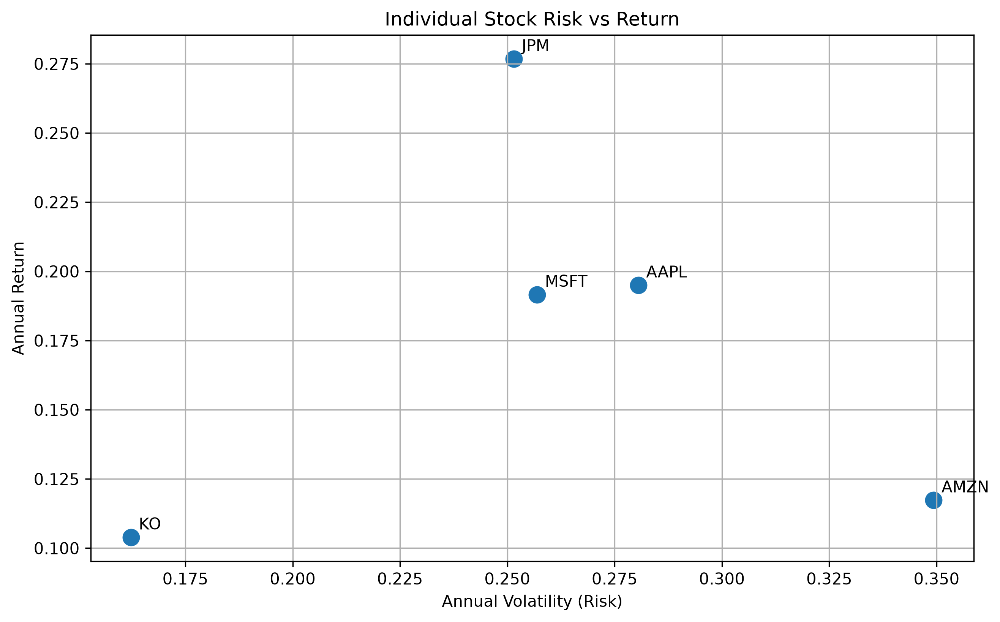
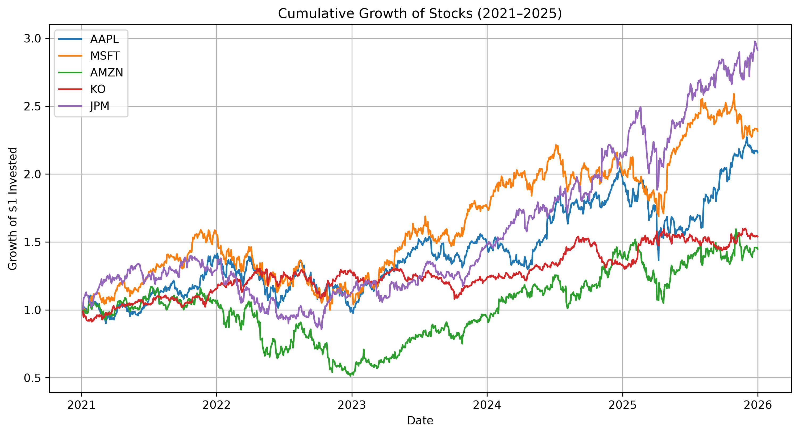

# Portfolio Optimisation and Risk Analysis

## Overview

This project uses Python and financial mathematics to analyse historical stock performance, measure investment risk, and optimise portfolio allocations. It explores the relationship between risk and return using historical market data.

## Objectives

* Analyse historical stock returns and volatility.
* Examine relationships between assets using covariance and correlation.
* Construct and compare portfolios with different investment strategies.
* Minimise portfolio volatility through numerical optimisation.
* Identify the maximum-return and maximum-Sharpe-ratio portfolios.
* Visualise portfolio risk and return using the efficient frontier.

## Assets Analysed

* Apple (AAPL)
* Microsoft (MSFT)
* Amazon (AMZN)
* JPMorgan Chase (JPM)
* Coca-Cola (KO)

## Technologies

* Python
* pandas and NumPy
* Matplotlib
* SciPy
* yfinance
* Jupyter Notebook

## Methods

1. Download and prepare historical market data.
2. Calculate daily returns and annualised performance metrics.
3. Estimate covariance and correlation between assets.
4. Construct an equally weighted portfolio.
5. Optimise portfolio allocations under long-only constraints.
6. Compare minimum-risk, maximum-return, and maximum-Sharpe-ratio portfolios.
7. Simulate random portfolios and calculate the efficient frontier.

## Key Results

The equally weighted portfolio achieved an annualised historical return of **17.69%** and annualised volatility of **18.83%**.

The minimum-risk portfolio achieved an annualised historical return of **14.45%** and annualised volatility of **14.34%**.

The maximum-return portfolio allocated 100% to JPMorgan Chase, producing an annualised historical return of **27.68%** and volatility of **25.15%**.

These results illustrate the trade-off between portfolio return and risk. The maximum-return portfolio is concentrated in one asset, while diversification can reduce portfolio volatility.

## Visualisations

### Efficient Frontier



### Cumulative Stock Returns



## Project Structure

```text
portfolio-optimisation/
├── data/
├── notebooks/
│   └── 01_data_exploration.ipynb
├── results/
│   ├── portfolio_comparison.csv
│   ├── optimal_weights.csv
│   ├── efficient_frontier.png
│   └── cumulative_returns.png
├── src/
├── README.md
└── .gitignore
```

## Limitations

* The analysis uses historical data, which does not guarantee future performance.
* The results depend on the selected assets and historical period.
* The optimisation assumes estimated returns and covariance are useful inputs for portfolio construction.
* Transaction costs, taxes, and changing market conditions are not modelled.

## Skills Demonstrated

Python programming, data analysis, statistical risk measurement, linear algebra, numerical optimisation, financial mathematics, data visualisation, and interpretation of quantitative results.

## Disclaimer

This project is for educational purposes only and does not constitute financial advice.

## Out-of-Sample Validation

To evaluate the optimised strategy on data not used during optimisation, the historical data was divided into a training period (2021–2023) and a testing period (2024–2025). The maximum-Sharpe portfolio weights were estimated using the training period and evaluated on the testing period.

| Portfolio                    | Annual Return | Annual Volatility | Sharpe Ratio |
| ---------------------------- | ------------: | ----------------: | -----------: |
| Equal-Weight Portfolio       |        22.67% |            16.42% |         1.14 |
| Training-Optimised Portfolio |        27.85% |            19.15% |         1.25 |
| S&P 500 Benchmark (SPY)      |        20.68% |            16.37% |         1.02 |

During the testing period, the training-optimised portfolio recorded the highest annualised return and Sharpe ratio among the three strategies. However, it also experienced the highest volatility.

The optimised allocation was concentrated in Microsoft (43.85%) and JPMorgan Chase (56.15%). This illustrates how mean-variance optimisation can produce concentrated allocations when it relies on estimated returns and covariance. Further investigation could examine allocation constraints and performance across additional testing periods.

**Limitations:** The analysis uses a small selection of five US stocks, a single training/testing split, and historical estimates that may not represent future conditions. Transaction costs, taxes, and rebalancing costs are not included. The results are for educational purposes and do not constitute financial advice.

## How to Run the Project

### 1. Clone the repository

```bash
git clone https://github.com/nsovohope62/portfolio-optimisation.git
cd portfolio-optimisation
```

### 2. Create a virtual environment

```bash
python -m venv .venv
```

Activate it:

**Linux / GitHub Codespaces / macOS**

```bash
source .venv/bin/activate
```

**Windows**

```bash
.venv\Scripts\activate
```

### 3. Install dependencies

```bash
pip install -r requirements.txt
```

### 4. Run the notebook

```bash
jupyter notebook notebooks/01_data_exploration.ipynb
```

The notebook downloads historical stock data using `yfinance`, calculates risk and return metrics, constructs and optimises portfolios, and evaluates the strategy on an out-of-sample testing period.

**Note:** An internet connection is required to download market data. Historical results may change if the data source revises its records.
